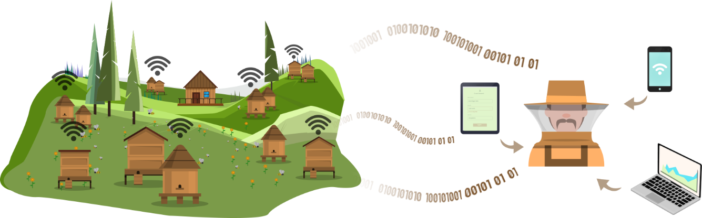

# **bee•z** - _link to your bees_ #

**bee•z** is a beekeeping system that solves the problems of beehive sensing, apiary management and maintenance planning.

## Concept ##

The system collects the operational **in-field** data, real-time **sensory** data, **environmental** parameters in an automatic or old-school manual way. Using the bee-friendly low radiation ways of communication (**LoRa**/**LoRaWAN**) the data is transferred for further processing.

The **beekeeper** can access this data remotely using his phone, tablet, or computer. With **advanced algorithms** and **machine-aided data processing**, the system acts like a digital side-kick that never sleeps and keeps the beekeeper on top of the situation.

## Development ##
Development artifacts are combined into this repository and are regulary synchronized with multiple internal repositories. There are the following parts:

- **general stuff, provisioning, database, integrations, ...** - in folder [system](/systeml)
- **web based portal** - in folder [portal](/portal)
- **gateway & nodes** - in folders [gateway](/gateway) and [node](/node)