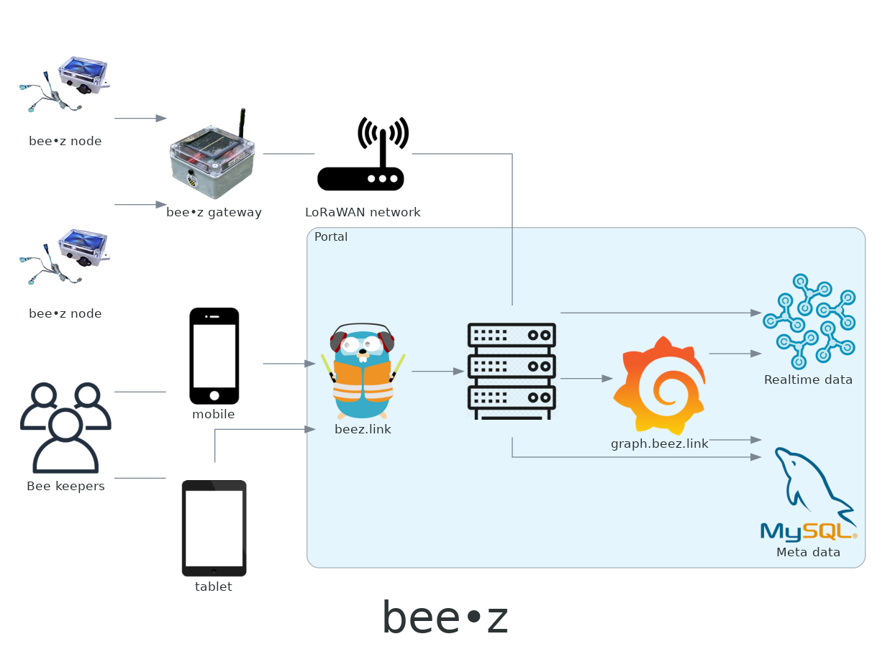

# **bee•z** - _link to your bees_ #

**bee•z** is a beekeeping system that solves the problems of beehive sensing, apiary management and maintenance planning. 

<p align="center">

[](https://www.youtube.com/watch?v=vOqbbXL7qxk)

(click for **bee•z** explainer 👆)

</p>

## Concept ##

The system collects the operational **in-field** data, real-time **sensory** data, **environmental** parameters in an automatic or old-school manual way. Using the bee-friendly low radiation ways of communication (**LoRa**/**LoRaWAN**) the data is transferred for further processing.


The **beekeeper** can access this data remotely using his phone, tablet, or computer. With **advanced algorithms** and **machine-aided data processing**, the system acts like a digital side-kick that never sleeps and keeps the beekeeper on top of the situation.

## Design ##
**bee•z** is combination of multiple hardware and software parts. Important modules/component/parts are shown on the folowing diagram:


## Development & Deployment ##
Development artifacts are combined into this repository and are  synchronized with multiple internal repositories. The major parts are:

- **general stuff, provisioning, database, integrations, ...** - in folder [system](/systeml)
- **web based portal** - in folder [portal](/portal)
- **gateway & nodes** - in folders [gateway](/gateway) and [node](/node)

There are no details development nor deployment guideliness, but in order to provision the system, use the following for local development:

```
docker-compose -p beez -f docker-compose.yml -f docker-compose-dev.yml --env-file dev.env up
```
or this, for testing purposes:
```
docker-compose -p beez -f docker-compose.yml -f docker-compose-tst.yml --env-file tst.env up
```

In order to deploy physical nodes, in addition to burning the firmware, in case of using LoRaWAN, it is necessery provision the device, which in case of The Things Network looks like:

```
ttn-lw-cli dev create beez <> \
  --device-id "<ID>" \
  --name "<NAME>" \
  --description "<DESCRIPITION>" \
  --frequency-plan-id EU_863_870_TTN \
  --lorawan-version 1.0.2 \
  --lorawan-phy-version 1.0.2-b \
  --abp \
  --mac-settings.resets-f-cnt \
  --session.dev-addr $(openssl rand -hex 4) \
  --session.keys.app-s-key.key $(openssl rand -hex 16) \
  --session.keys.f_nwk_s_int_key.key $(openssl rand -hex 16)
  ```